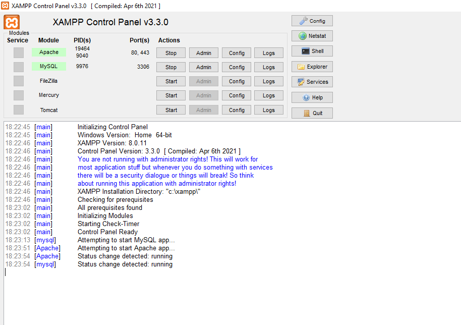
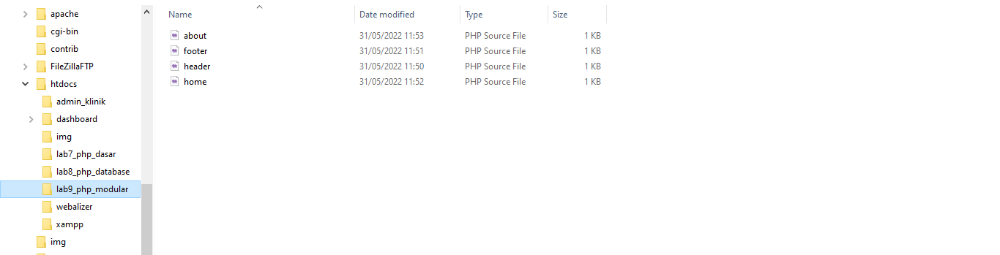
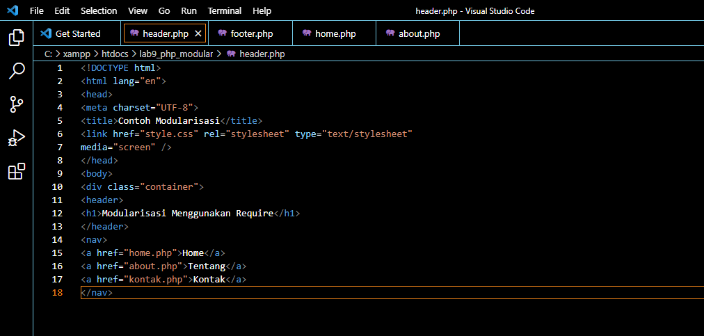
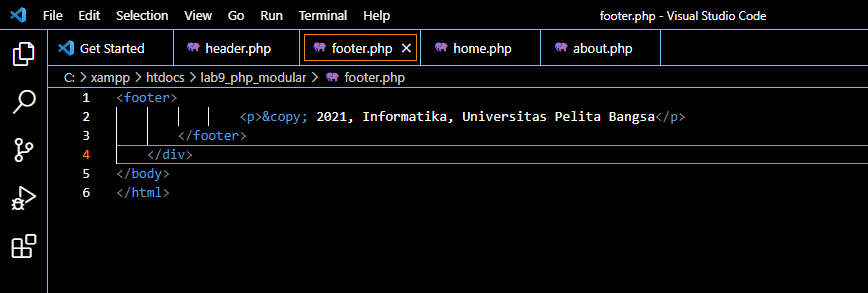
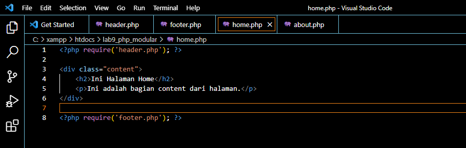
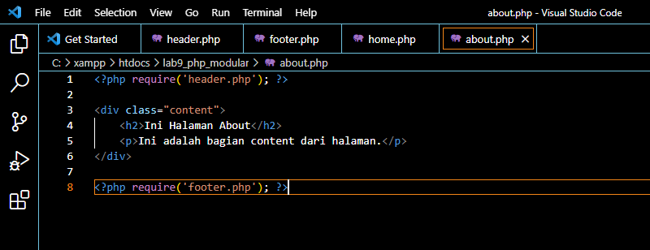
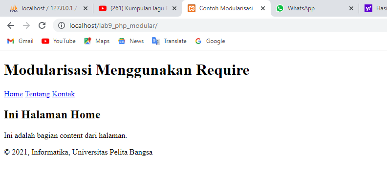
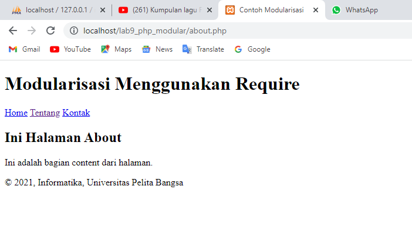
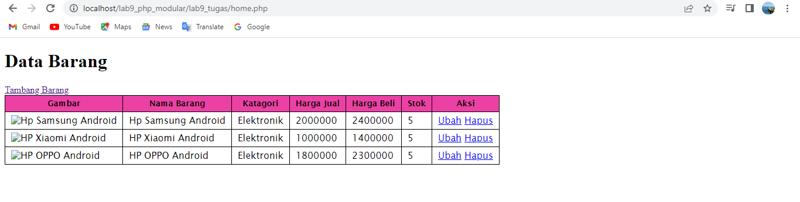
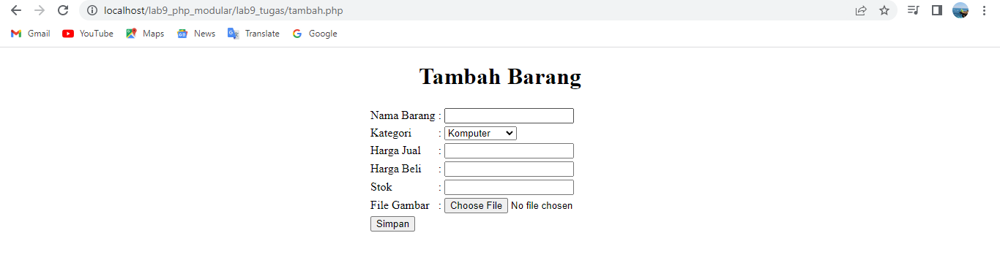

|   Rony Eltom Atibaman  |   TI.20.D.1   |
|------------------------|---------------|
|     Pemrograman Web    |  Praktikum 9  |

# Lab9Web
Disini saya akan membuat prpgram modular sederhana menggunakan PHP
# Langkah - langkah Praktikum

## Menjalankan XAMPP server


## 1). Buat folder baru dengan nama lab9_php_modular pada docroot webserver


## 2). Buat file baru dengan nama header.php
```
<!DOCTYPE html>
<html lang="en">
<head>
<meta charset="UTF-8">
<title>Contoh Modularisasi</title>
<link href="style.css" rel="stylesheet" type="text/stylesheet" media="screen" />
</head>
<body>
    <div class="container">
<header>
    <h1>Modularisasi Menggunakan Require</h1>
</header>
    <nav>
        <a href="home.php">Home</a>
        <a href="about.php">Tentang</a>
        <a href="kontak.php">Kontak</a>
</nav>
```


## 3). Buat file baru dengan nama footer.php
```
<footer>
                <p>&copy; 2021, Informatika, Universitas Pelita Bangsa</p>
        </footer>
    </div>
</body>
</html>
```


## 4). Buat file baru dengan nama home.php
```
<?php require('header.php'); ?>

<div class="content">
    <h2>Ini Halaman Home</h2>
    <p>Ini adalah bagian content dari halaman.</p>
</div>

<?php require('footer.php'); ?>
```


## 5). Buat file baru dengan nama about.php
```
<?php require('header.php'); ?>

<div class="content">
    <h2>Ini Halaman About</h2>
    <p>Ini adalah bagian content dari halaman.</p>
</div>

<?php require('footer.php'); ?>
```


## 6). Hasil tampilan halaman home pada browser dengan menggunakan modular header dan footer


## 7). Hasil tampilan halaman about pada browser dengan menggunakan modular header dan footer


----------------------------------------------------

# Pertanyaan & Tugas
Implementasikan konsep modularisasi pada kode program praktikum 8 tentang
database, sehingga setiap halamannya memiliki template tampilan yang sama.

# Hasil Run
## - Tampilan halaman home


## - Tampilan halaman tambah barang


# SEKIAN & TERIMA KASIH